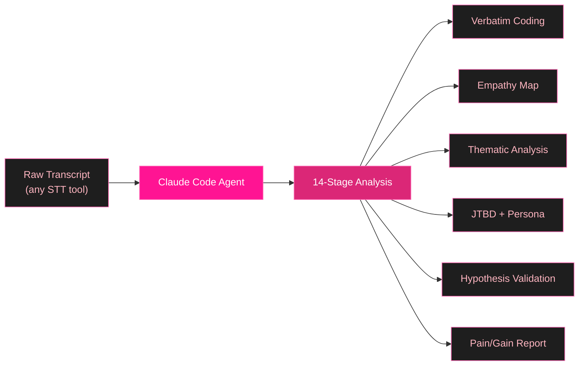
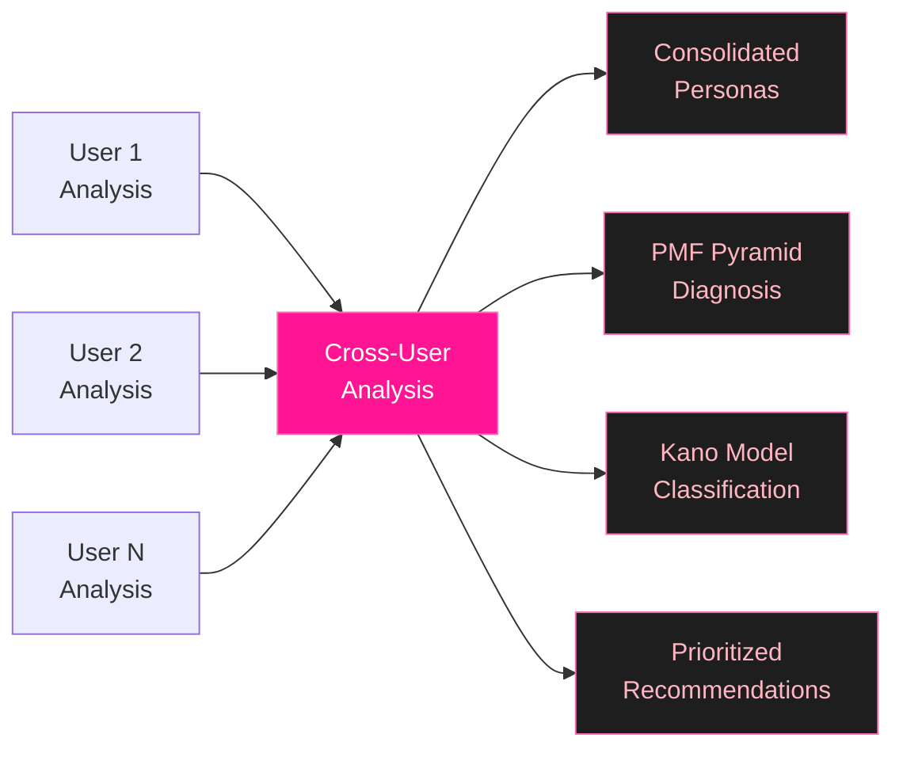

<div align="center">


<br/>


<br/>
<br/>

[](LICENSE)
[](https://claude.ai/claude-code)
[](https://github.com/Lee-Soyeon/ux-research-agents/stargazers)
[](CONTRIBUTING.md)

<br/>

[](#-quick-start)
[](#-whats-inside)
[](#-example-output)
[](#-roadmap)
[](#-contributing)

</div>

<br/>

## The Problem

UX researchers spend **60-70% of their time** on analysis and synthesis -- not research itself.

Commercial tools (Dovetail, Maze, Marvin) cost **$100-500/month** and still require significant manual work.

<table>
<tr>
<td width="50%" valign="top">

**Without this toolkit**

- Transcribe interview (30 min)
- Read through transcript (45 min)
- Extract key quotes (60 min)
- Code and categorize (90 min)
- Synthesize findings (120 min)
- Write report (90 min)

**Total: 7+ hours per interview**

</td>
<td width="50%" valign="top">

**With UX Research Agents**

- Feed transcript to agent
- Get structured analysis back
- Review and refine

**Total: 15-30 minutes per interview**

</td>
</tr>
</table>

<br/>

## How It Works



For multiple users, run **Cross-User Analysis** to consolidate:



<br/>

## What's Inside

### 1. Deep Research Analyzer

> A comprehensive 14-stage analysis pipeline applying established UX research frameworks to raw interview transcripts. Over 1,200 lines of battle-tested prompts.

**`agents/ut-research-analyzer.md`**

<table>
<tr>
<td align="center" width="25%"><strong>Stage 1-4</strong><br/><sub>Foundation</sub></td>
<td align="center" width="25%"><strong>Stage 5-8</strong><br/><sub>Synthesis</sub></td>
<td align="center" width="25%"><strong>Stage 9-12</strong><br/><sub>Deep Analysis</sub></td>
<td align="center" width="25%"><strong>Stage 13-14</strong><br/><sub>Validation</sub></td>
</tr>
<tr>
<td valign="top">

Preprocessing<br/>
Verbatim Coding<br/>
Behavioral Sequence<br/>
Emotional Journey

</td>
<td valign="top">

Empathy Map (NNG)<br/>
Thematic Analysis<br/>
Affinity Mapping<br/>
Jobs-to-be-Done

</td>
<td valign="top">

Proto-Persona (NNG)<br/>
Mental Model Gap<br/>
7 Stages of Action<br/>
3 Levels of Processing

</td>
<td valign="top">

Hypothesis Validation<br/>
Nielsen's Heuristics<br/>
Pain/Gain Analysis<br/>
Sprint Recommendations

</td>
</tr>
<tr>
<td><sub>Don Norman</sub></td>
<td><sub>Braun & Clarke, NNG</sub></td>
<td><sub>Don Norman</sub></td>
<td><sub>Nielsen, Dan Olsen</sub></td>
</tr>
</table>

**Cross-User Analysis** (8 additional stages):

| Stage | Method | Framework |
|:------|:-------|:----------|
| C1 | Verbatim cross-comparison | Pattern matching |
| C2 | Hypothesis cross-validation | Evidence aggregation |
| C3 | Theme cross-mapping | Universal / Major / Segment / Unique |
| C4 | Persona consolidation | 2-3 representative personas |
| C5 | Importance-Satisfaction Gap | Lean Product Playbook (Dan Olsen) |
| C6 | PMF Pyramid mapping | 5-layer product-market fit |
| C7 | Kano Model classification | Must-be / Performance / Delighter |
| C8 | Actionable recommendations | Problem Space vs Solution Space |

<br/>

### 2. Sprint Transcript Analyzer

> Fast, hypothesis-driven analysis for sprint retrospectives. Auto-tags every utterance and validates sprint hypotheses.

**`agents/ut-transcript-analyzer.md`**

6 semantic tags applied to every user utterance:

```
[PAIN]  Frustration, complaint       "The options are too limited"
[AHA]   Positive surprise, delight   "I didn't expect to get so into this"
[WTP]   Willingness to pay/reuse     "At $3, I'd consider it"
[BEHAV] Observable behavior           Hesitation at 03:42, repeated exploration
[NEED]  Feature request               "It would be nice if it had..."
[COMP]  Competitor comparison          "Notion does X, but this..."
```

Auto-generates hypothesis validation verdicts:
**Validated** | **Partially Validated** | **Rejected** | **Insufficient Data**

<br/>

### 3. Standalone Prompt

> Works with any LLM, no setup required. Copy-paste into ChatGPT, Claude, Gemini, or any LLM.

**`prompts/ut-auto-summary.md`**

Get a Slack-ready sprint retrospective summary in seconds.

<br/>

## Quick Start

### Prerequisites

- [Claude Code CLI](https://docs.anthropic.com/en/docs/claude-code) installed
- Interview transcripts from any STT tool (Clova Note, Otter.ai, Whisper, etc.)

### Installation

```bash
git clone https://github.com/Lee-Soyeon/ux-research-agents.git

# Copy agents to your Claude Code config
cp ux-research-agents/agents/*.md ~/.claude/agents/
```

### Usage

**Deep analysis (14-stage):**
```bash
# In Claude Code, invoke the agent:
@ut-research-analyzer Analyze /path/to/transcript.txt
Hypotheses: "Users will complete onboarding without help"
```

**Sprint analysis (quick):**
```bash
@ut-transcript-analyzer Analyze /path/to/transcript.txt
Hypothesis: "The new search flow increases task completion rate"
```

**Any LLM (no setup):**
Copy `prompts/ut-auto-summary.md` and paste into any LLM with your transcript.

> [!TIP]
> Start with the Sprint Transcript Analyzer for quick results, then use the Deep Research Analyzer when you need comprehensive insights.

<br/>

## Example Output

<details>
<summary><strong>Click to expand sample analysis output</strong></summary>

<br/>

```markdown
# Sprint 2 - UT Sprint Summary: User #8

> Testing scope: Onboarding flow + task creation + dashboard comprehension

## User Info
- 24F, college student, no prior experience with this product category
- Segment: New User

## 0. One-line Key Finding
- Onboarding flow successfully built initial understanding,
  but dashboard complexity caused confusion and reduced task completion.

## 1. Tagged Key Utterances

### [PAIN]
> "I don't really get what this button does" (03:42)
> "There are too many things on this screen" (11:20)

### [AHA]
> "Oh wait, this actually makes sense now" (08:15)
> "I like how it shows me what to do next" (06:30)

### [WTP]
> "If it saved me this much time every week... maybe $5/month?" (22:30)

### [NEED]
> "It would be nice if I could undo this" (14:55)

## 2. Hypothesis Validation

**H1: Users complete onboarding without assistance**
**Verdict: Partially Validated**

| Axis            | Verdict | Evidence                               |
|-----------------|---------|----------------------------------------|
| Task completion | Present | Completed 4/5 steps independently      |
| Comprehension   | Weak    | "What does this icon mean?" (05:12)    |
| Satisfaction    | Present | "That was pretty straightforward" (07:45) |

## 3. Usability Issues

| Screen    | Issue                   | Heuristic              | Severity |
|-----------|-------------------------|------------------------|----------|
| Dashboard | Icon meaning unclear    | Recognition > Recall   | 3/4      |
| Settings  | No confirmation on save | System Status Visibility | 2/4    |
```

</details>

<br/>

## Methodology References

> This toolkit is built on established, peer-reviewed UX research frameworks.

| Framework | Author | Applied In |
|:----------|:-------|:-----------|
| Empathy Mapping, Persona Development | **Nielsen Norman Group** | Stages 5, 9 |
| Mental Model Gap, 7 Stages of Action, 3 Levels of Design | **Don Norman** | Stages 10, 11, 12 |
| 6-Phase Thematic Analysis | **Braun & Clarke** | Stage 6 |
| Lean Product Playbook, PMF Pyramid | **Dan Olsen** | Cross-Analysis C5, C6 |
| Jobs-to-be-Done | **Clayton Christensen** | Stage 8 |
| Kano Model | **Noriaki Kano** | Cross-Analysis C7 |
| 10 Usability Heuristics | **Jakob Nielsen** | Stage 14 |
| Peak-End Rule | **Daniel Kahneman** | Stage 4 |

<br/>

## Project Structure

```
ux-research-agents/
├── agents/                          # Claude Code agents (drop-in ready)
│   ├── ut-research-analyzer.md      # 14-stage deep analysis (1,200+ lines)
│   └── ut-transcript-analyzer.md    # Sprint-level quick analysis
├── prompts/                         # Standalone prompts (any LLM)
│   └── ut-auto-summary.md           # Quick Slack-ready summary
├── examples/                        # Try it yourself
│   └── sample-transcript.md         # Fictional sample interview
├── templates/                       # Reusable research templates
│   ├── ut-interview-guide.md        # Interview guide template
│   └── hypothesis-template.md       # Sprint hypothesis template
├── CONTRIBUTING.md
├── LICENSE
└── README.md
```

<br/>

## Roadmap

- [x] Core analysis agents (14-stage + sprint-level)
- [x] Cross-user analysis (8-stage, Lean Product Playbook)
- [x] Standalone prompt for any LLM
- [x] Interview guide & hypothesis templates
- [ ] PostHog session replay AI analysis agent
- [ ] Playwright-based automated UX testing agent
- [ ] Hotjar / FullStory session replay analysis
- [ ] Video / screen recording analysis (mp4 to UX insights)
- [ ] Multi-language transcript support
- [ ] Integration with Notion / Linear for issue tracking

<br/>

## Who Is This For

| Role | Use Case |
|:-----|:---------|
| **UX Researchers** | Speed up analysis without losing academic rigor |
| **Product Managers** | Get evidence-based sprint retrospectives |
| **Startup Founders** | Run lean user tests with limited resources |
| **Students & Educators** | Learn UX research methodologies through practice |
| **Design Teams** | Build shared understanding from user data |

<br/>

## Contributing

Contributions welcome! See [CONTRIBUTING.md](CONTRIBUTING.md) for guidelines.

Ways to contribute:
- Add new analysis methodologies or frameworks
- Share anonymized example transcripts
- Improve multi-language support
- Build integrations (PostHog, Hotjar, Maze, Dovetail)
- Report issues or suggest improvements

<br/>

## About

Built by [Soyeon Lee](https://github.com/Lee-Soyeon) -- from real pain of analyzing **50+ user interviews** across multiple product discovery sprints.

> Rigorous UX research shouldn't require expensive tools or weeks of manual analysis.
> Every framework and rule in these agents comes from hands-on experience
> running user tests and iterating on real products.

<br/>

## License

[MIT License](LICENSE) -- use it, modify it, share it.

<br/>

<div align="center">


<br/>


<br/>
<br/>

[](https://github.com/Lee-Soyeon/ux-research-agents)
[](https://github.com/Lee-Soyeon/ux-research-agents/stargazers)

</div>


